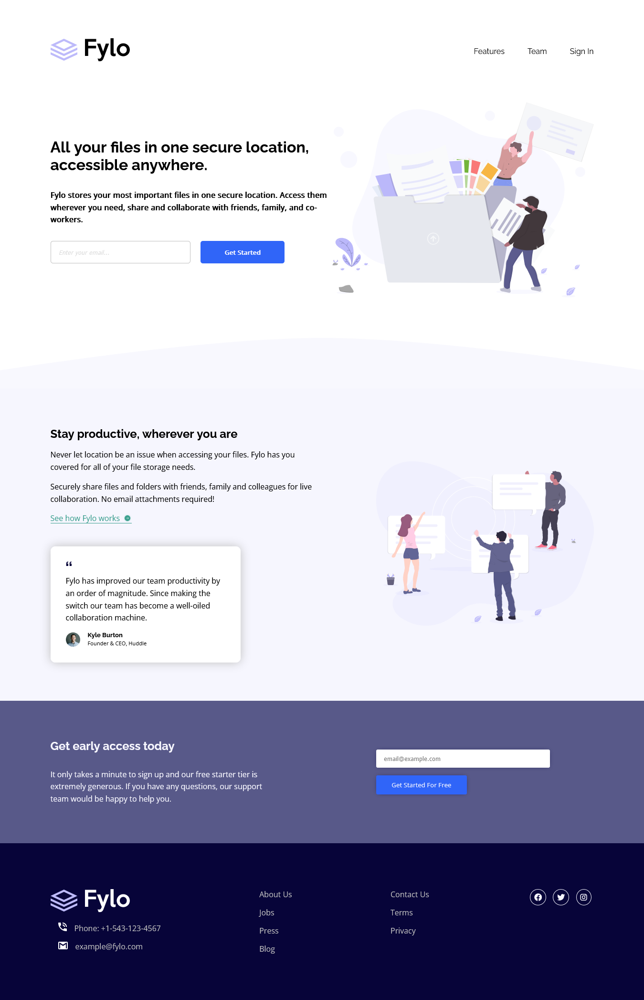

# Frontend Mentor - Fylo landing page with two column layout solution

This is a solution to the [Fylo landing page with two column layout challenge on Frontend Mentor](https://www.frontendmentor.io/challenges/fylo-landing-page-with-two-column-layout-5ca5ef041e82137ec91a50f5). Frontend Mentor challenges help you improve your coding skills by building realistic projects.

## Table of contents

- [Overview](#overview)
  - [Screenshot](#screenshot)
  - [Links](#links)
  - [Built with](#built-with)
- [Author](#author)

## Overview

Built with ❤️ By Ragab  
Built with Flexbox

### Screenshot

### Links

- Solution URL: [@frontend mentor](https://www.frontendmentor.io/solutions/responsive-fylo-landing-page-for-all-screens-flexbox-_-ahi0kYGt)
- Live Site URL: [@github pages](https://ragabogaa.github.io/fylo/)

### Built with

- Semantic HTML5 markup
- CSS custom properties
- Flexbox

## Author

- Website - [@github](https://github.com/RagaBoGaa)
- Frontend Mentor - [@ragaboga](https://www.frontendmentor.io/profile/RagaBoGaa)
